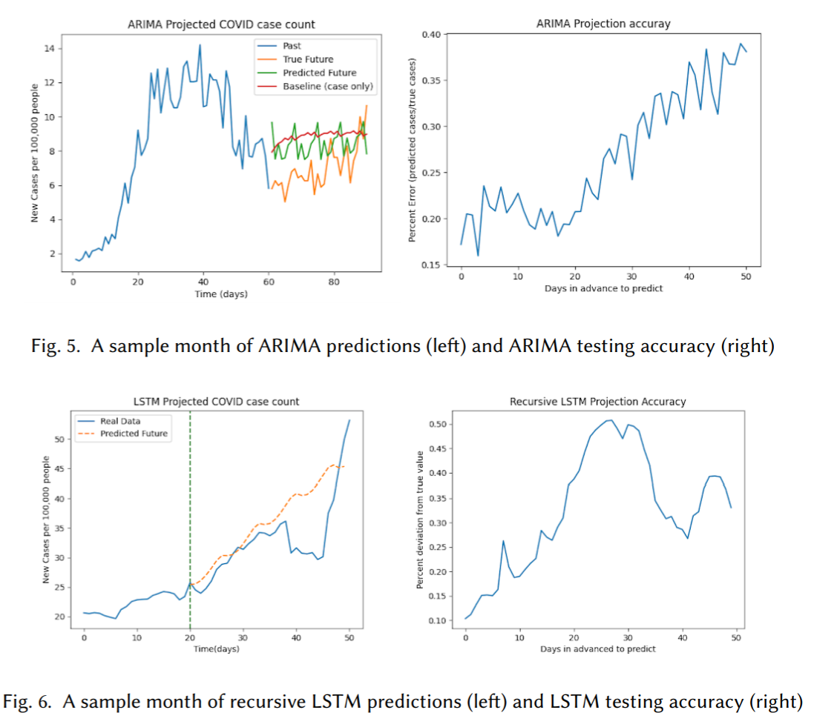

# Forecasting of COVID-19 Cases Using Time-Series Analysis of Google Mobility Data

This project uses anonymous location data from Google to supplement prediction models of COVID-19 case numbers. The location data indicates how much people are traveling, working from home, or visiting other locations of interest such as entertainment venues. The additional data allows our model to predict further into the future, beating the baseline by 40% in the medium to long term prediction. View the [project report here](https://www.luisjguzman.com/media/Csci5525/Forecasting_of_COVID_19_Cases_Using_Time_Series_Analysis_of_Google_Mobility_Data.pdf)

### Datasets:
	
A number of different datasets were created for this project.  For the original progress report, the `2020_US_Region_Mobility_Report.csv`, `United_States_COVID-19_Cases_and_Deaths_by_State_over_Time.csv`, and `SCPRC-EST2019-18+POP-RES.csv` were used by `create_dataset.py`.  The case numbers from the CDC dataset was matched by state and date with the mobility data from Google.  The third dataset is used to get state populations in order to normalize the number of cases by the 100,000 people per state.  This originally created the `COVID-19_Combined_Mobility_And_Infection_Data_Moving_Avg.csv`, and the `COVID-19_Combined_Mobility_And_Infection_Data.csv`.  Only the moving average dataset ended up being utilized.  For the final report, the CDC data and Google Mobility data were redownloaded, as they now included additional data.  These are named the `2020_US_Region_Mobility_Report_dec.csv`, `United_States_COVID-19_Cases_and_Deaths_by_State_over_Time_dec.csv`.  `create_dataset.py` was again utilized with the new datasets, building `COVID-19_Combined_Mobility_And_Infection_Data_Moving_Avg_updated.csv`, and the `COVID-19_Combined_Mobility_And_Infection_Data_updated.csv`.  These datasets had some missing data, and were thus updated to replace the missing data.  As the moving average dataset is the only one utilized in our models, that was the only one filled in to save time.  Finally, `COVID-19_Combined_Mobility_And_Infection_Data_Moving_Avg_updated_test_mode.csv` is the updated dataset with the missing features filled with the mode of that feature, and `COVID-19_Combined_Mobility_And_Infection_Data_Moving_Avg_updated_lin_int.csv` is the updated dataset with the missing features filled using linear interpolation.

### Baseline and POC model:

To run the baseline and generate plots, run `baseline_full_data_shift_by_state.py`.  You can also run baseline.py to just run this for Minnesota data, which takes much less time to run.
	

### LSTM:

To run the LSTM and generate plots, run `lstm_recursive.py` or `lstm_direct.py`.  More details located in readme inside lstm folder.
	
	
### ARIMA:

To run the ARIMA+MLP model and generate plots, run `arima.py` or `arima_multi.py`.  More details located in readme inside arima folder.
